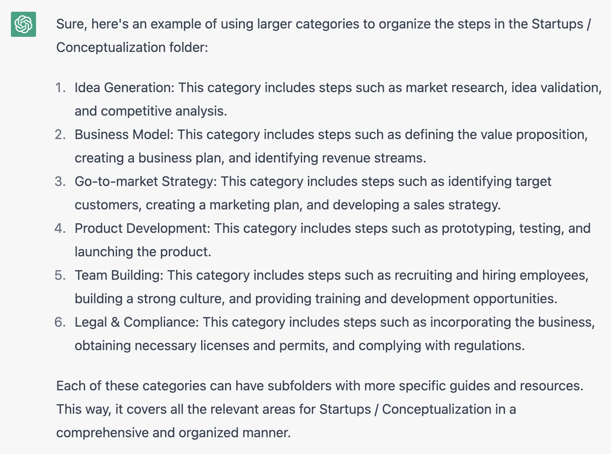

## Conceptualization

This folder contains guides and resources for entrepreneurs and startups at the conceptualization stage. The guides are organized into the following categories:

### Idea Generation

This category includes steps such as market research, idea validation, and competitive analysis. These guides will help you to understand your target market, validate your business idea, and identify potential competitors.

### Business Model

This category includes steps such as defining the value proposition, creating a business plan, and identifying revenue streams. These guides will help you to develop a sustainable business model that meets the needs of your customers and generates revenue.

### Go-to-market Strategy

This category includes steps such as identifying target customers, creating a marketing plan, and developing a sales strategy. These guides will help you to understand your target audience, create a plan to reach them, and develop a strategy for selling your product or service.

### Product Development

This category includes steps such as prototyping, testing, and launching the product. These guides will help you to develop a product that meets the needs of your customers, test it with a small group of users, and launch it to the market.

### Team Building

This category includes steps such as recruiting and hiring employees, building a strong culture, and providing training and development opportunities. These guides will help you to build a strong and effective team, create a positive and productive work environment, and provide opportunities for growth and development.

### Legal & Compliance

This category includes steps such as incorporating the business, obtaining necessary licenses and permits, and complying with regulations. These guides will help you to navigate the legal and compliance landscape, ensure that your business is in compliance with all relevant laws and regulations, and protect your business from potential legal liabilities.

Please note that this is a high-level categorization and some steps may overlap with others.

---

### Evidence

Here is a screenshot of the category breakdown as provided by ChatGPT:

  

